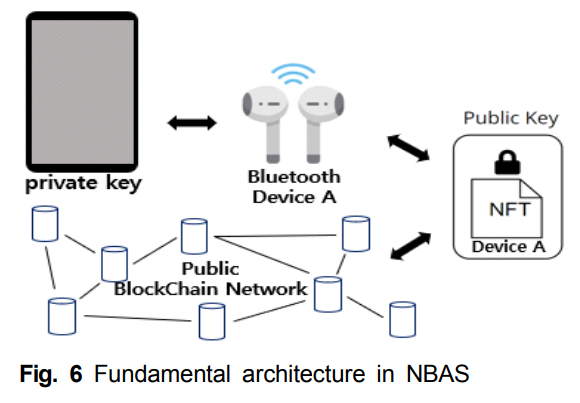
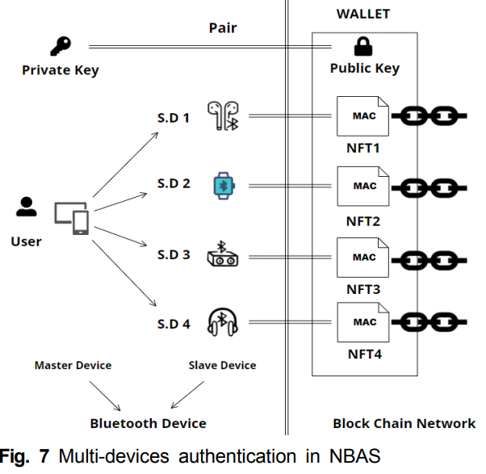
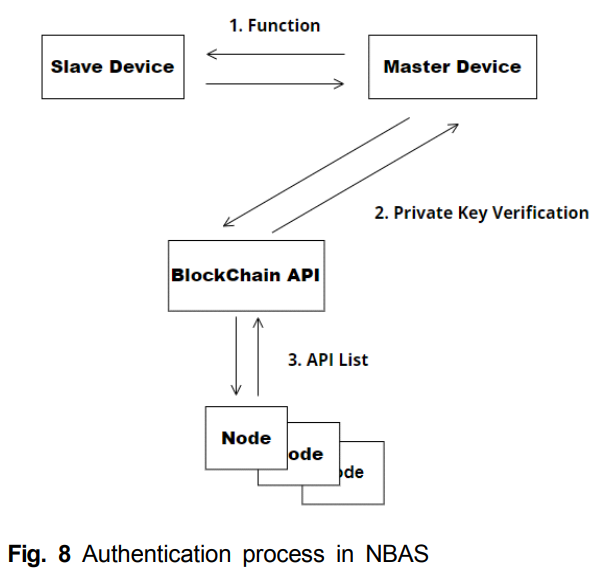
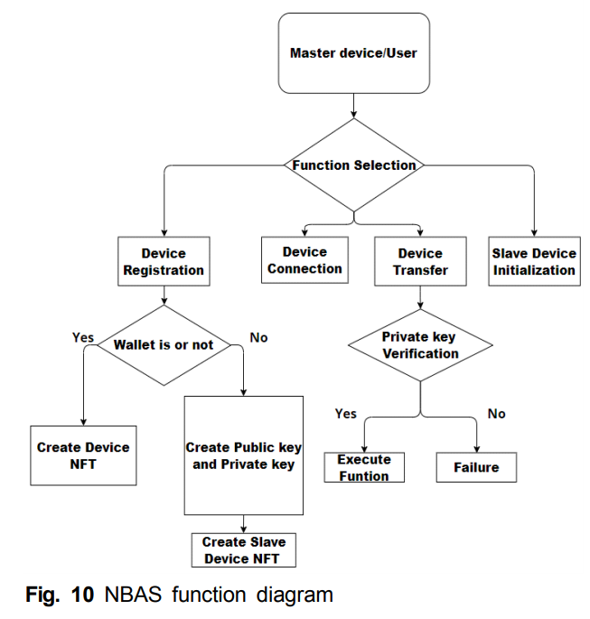
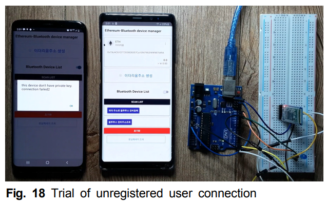
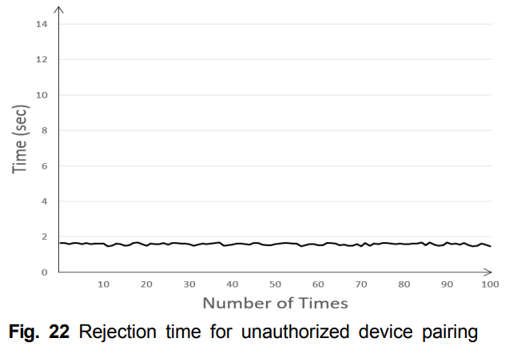

# NBAS-paper, Patent-application
NBAS : NFT Based Authentication System KCI논문

특허 출원 : 10-2022-0072129
#
## NBAS paper
### 요약 
블루투스 이어폰과 같은 대부분의 블루투스 장치는 무선이라는 편리성으로 다양하게 사용되지만 소형 무선기기라는 특성으로 자주 분실되는 단점이 있다. 그러나 대부분의 블루투스 장치에서는 합법적인 소유자에 대한 인증 기능 제공이 미흡하며, 분실된 블루투스 장치를 습득한 제 3자는 해당 기기를 손쉽게 자신의 스마트기기 등에 연결하여 사용할 수 있다. 

본 논문에서는 분실이 잦은 블루투스 장치에서 NFT를 이용하여 합법적인 소유자를 인증하는 NBAS(NFT-based Bluetooth Device Authentication System)에 대해서 제안하였다. 

NBAS는 탈중앙화된 네트워크인 이더리움 블록체인을 활용하여 이더리움상에 디지털 지갑을 생성하고, 디지털 지갑에 블루투스 장치의 MAC 주소를 이용하여 NFT를 생성하고 보관한다. 지갑의 소유자는 개인키를 사용하여 NFT의 소유를 증명함으로써 블루투스 장치의 합법적인 소유자임을 인증하게 된다. 

NBAS는 평균 10.25sec의 초기 페어링 시간을 보였으며 재연결 시간은 0.007sec로 기존 방식과 비슷하며, 미승인 사용자에 대한 페어링 거절 시간은 평균 1.58sec로 측정되었다. 따라서 제
안하는 NBAS는 미승인된 블루투스 장치의 연결을 방지하여 기존의 보안성이 약한 블루투스 인증 방식을 효과적으로 개선함을 보여준다.

#
### 제작 배경
1. 블루투스 장치 분실문제 사례 증가
2. 블루투스 장치 보안문제 사례 증가

#
### 관련 연구
1. Bluetooth Pairing key
2. NFT

#
### 구성 요소

 

#### 사용자는 자신의 마스터 장치(스마트폰)를 소지한다. 마스터 장치는 슬레이브 장치(무선 이어폰)와 페어링 된다. 
#### 사용자는 페어링 과정에 마스터 장치를 통해 슬레이브 장치의 NFT를 지갑에 생성하게 된다. 
#### 공개키와 개인키를 쌍으로 생성하여 마스터 장치 내부에 개인키를 저장한다. 
#### 이때 슬레이브 장치의 NFT는 장치에 내장된 고유한 MAC 주소를 포함한다. 
  
#
### 여러대 인증시

 
  
#### 일반적으로 1명의 사용자는 다수의 블루투스 장치를 소유할 수 있다. 
#### 그림 7은 1명의 사용자가 다수의 슬레이브 장치를 소지하는 경우의 NBAS 구성도를 나타낸 것이다. 
#### 슬레이브 장치들은 사용자의 지갑 내부에 NFT 리스트로 저장되며 페어링 단계에서 마스터 장치에 저장된 개인키를 통해 인증되게 된다
  
#
### 인증 방식

 
  
#### NBAS의 인증 절차는 개인키와 공개키 쌍을 검증하는 과정으로 그림 8에서와 같이 이루어진다. 
#### 개인키는 Web3 Secret Storage Definition에서 정의한 표준 양식 PBKDF2-SHA-256을 활용하여 마스터 장치에 저장된다. 
#### 마스터 장치는 이더리움에서 제공하는 API를 사용하여 노드와 통신한다. 
#### 각 노드들은 분산 원장에 저장되어 있는 장부를 통하여 NFT의 존재 유무를 검증하는 방식으로 인증하게 된다.
  
#
### 기능

 
  
#### NBAS는 장치 등록, 장치 연결, 장치 양도, 초기화 등의 4가지 기능을 제공한다. 
#### 그림 10은 NBAS에서 제공하는 4가지 기능들에 대한 흐름도를 나타낸 것이다
  
#
### 실험 및 결과

 
  
#### 모의 실험 환경은 합법적인 블루투스 장치 소유자 스마트폰 A(사용자 마스터 장치), 미등록 스마트폰 B(미등록 마스터 장치)와 블루투스 장치 C(슬레이브 장치)로 구성된다
  

 
  
#### NBAS는 NFT를 활용하여 미승인된 장치의 승인을 거절함으로써 기존 블루투스 장치의 분실, 도난에 대한 보안성을 제공한다. 
#### 그림 22에서처럼 미승인된 장치에서 이더리움에 등록된 슬레이브 장치에 페어링을 요청하는 경우 미승인 장치의 접근은 페어링이 제한되며 NBAS의 거절 시간은 평균 1.58sec로 측정되었다. 
#### 이는 NBAS와 기존 블루투스 페어링을 구분짓는 중요한 특징으로 NBAS는, 미승인 장치의 페어링을 효과적으로 제한함을 보여준다.

  
#
### 결론
#### 본 연구에서는 기존의 블루투스 장치에서 분실 취약점을 해결하기 위한 방안으로 NFT기반으로 블루투스 장치를 인증하는 NBAS를 제안하였다. 
#### 블루투스 장치의 초기 페어링 단계에서 슬레이브 장치의 고유정보를 NFT화하여 등록하고 생성한 합법적인 소유자만 해당 NFT에 접근하는 절차를 제안하였다. 
#### NBAS의 초기 페어링 시간은 평균 10.25sec이고 재연결 시간은 평균 0.007sec으로 측정되었다. 
#### 또한 NBAS는 미등록장치를 평균 1.58sec로 거절함을 보여주었다. 
#### 이는 장치 등록 후 다른 소유자 혹은 다른 기기에서 접근을 효과적으로 제한하며 보안성을 강화하였음을 보여준다. 
#### 제안하는 시스템은 다양한 형태의 블루투스 장치가 존재하는 환경에서 보안을 강화하고 분실된 블루투스 장치의 무분별한 사용을 방지하는 해결책으로 활용될 수 있을 것으로 기대된다.
  
